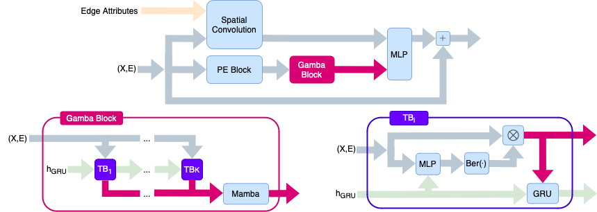

# 🦐 Gamba: Scalable Attention Based Graph-to-Sequence Modeling

Group project for the course _Deep Learning (263-3210-00L)_ at ETH Zurich.
___

### Abstract

Graph neural networks (GNNs) using iterative one-hop message passing often fail to leverage information from distant nodes, while graph transformers can attend to all nodes but lack inherent inductive biases and suffer from a quadratic time-complexity. We propose Graph Mamba (Gamba), a novel architecture generating a virtual sequence of tokens of fixed length by autoregressively aggregating node features globally and then processing this sequence with Mamba. Our approach achieves a comparable performance to state-of-the-art graph transformers on various benchmarks while significantly reducing computational costs.
Code available at: [github.com/BenBullinger/Gamba](https://github.com/BenBullinger/Gamba).



### Installation:
This is a short introduciton how to run things:

* Create a conda env with `CONDA_OVERRIDE_CUDA=12.4 conda create --name [env name] python=3.12.7`
* Install torch and its dependencies `conda install pytorch==2.4.0 torchvision==0.19.0 torchaudio==2.4.0 pytorch-cuda=12.4 -c pytorch -c nvidia`
* Install PyG `pip install torch_geometric`
* Install PyG dependencies `pip install pyg_lib torch_scatter torch_sparse torch_cluster torch_spline_conv -f https://data.pyg.org/whl/torch-2.4.0+cu124.html`
* Install other dependencies `pip install wandb pandas tabulate`


* To run gamba install transformers `pip install transformers`

* Then also install `pip install ray[tune]` and `pip install pynndescent`

To run wandb logging, add your API key to `wandb.key`. (Wandb logging is currently unimplemented)

### Running Experiments:

To run experiments run the python file

```bash
python run_multiple_configs.py
```

after specifying the config files of the experiments to run in its main function

```python3
if __name__ == "__main__":
    # List of configuration files
    config_files = [
        "data/configs/[config_name_1].json",
        "data/configs/[config_name_2].json",
        ...
    ]

    run_experiments(config_files, num_trials=3) 
```

Each experiment is repeated with different random seeds for `num_trials` trials. The results and aggregate statistics (mean and standard deviation) across the experimental trials are saved to the `results` directory.

Configs used in the paper are found in [here](data/configs/Paper_Experiments)

#### Using Google Colab:

To easily make use of Google Colab GPUs we provide the notebook `google_colab.ipynb`. It allows to run experiments directly from a Google Colab GPU environment. It requires that this repository is installed into `/content/drive/MyDrive/DL_Project/DL_Project/`.